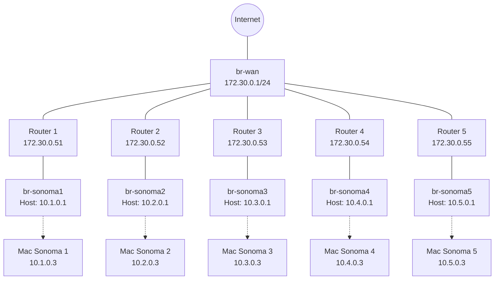

# Hướng Dẫn Thiết Lập Khởi Tạo và Cấu Hình Thủ Công 5 Router Kwrt (Từ A-Z)

Dưới đây là tài liệu tổng hợp toàn bộ quy trình từ khâu tạo mạng, cấp quyền (chạy 1 lần trên máy Host) cho đến các lệnh khởi chạy và cấu hình thủ công cho riêng từng Router.

## 🗺️ Mô Hình Mạng (Network Topology)


## 📊 Bảng Chi Tiết Cấu Hình 5 Router

| Rtr | WAN IP (br-wan) | LAN IP (br-lan) | Tên Bridge (Host) | IP Host (Gateway Mac) | Mạng Docker | MAC (LAN) | MAC (WAN) |
|---|---|---|---|---|---|---|---|
| **1** | `172.30.0.51` | `10.1.0.2` | `br-sonoma1` | `10.1.0.1` | `lan-net-01` | `52:54:00:01:01:01` | `52:54:00:01:01:02` |
| **2** | `172.30.0.52` | `10.2.0.2` | `br-sonoma2` | `10.2.0.1` | `lan-net-02` | `52:54:00:01:02:01` | `52:54:00:01:02:02` |
| **3** | `172.30.0.53` | `10.3.0.2` | `br-sonoma3` | `10.3.0.1` | `lan-net-03` | `52:54:00:01:03:01` | `52:54:00:01:03:02` |
| **4** | `172.30.0.54` | `10.4.0.2` | `br-sonoma4` | `10.4.0.1` | `lan-net-04` | `52:54:00:01:04:01` | `52:54:00:01:04:02` |
| **5** | `172.30.0.55` | `10.5.0.2` | `br-sonoma5` | `10.5.0.1` | `lan-net-05` | `52:54:00:01:05:01` | `52:54:00:01:05:02` |

---

## 🛠 PHẦN A: CẤU HÌNH HẠ TẦNG HOST (Chạy 1 lần)

Mở Terminal trên máy chủ Linux và lần lượt copy/paste các khối lệnh sau đây để chạy (yêu cầu quyền `sudo` khi thiết lập mạng):

**1. Chuẩn bị thư mục chứa dữ liệu Router**
```bash
mkdir -p /home/luka-doncic/Documents/routers
mkdir -p /etc/qemu
```
*Lệnh kiểm tra:* `ls -ld /home/luka-doncic/Documents/routers /etc/qemu`

**2. Tạo mạng WAN chung**
```bash
docker network create --subnet 172.30.0.0/24 --opt com.docker.network.bridge.name=br-wan wan-total
```
*Lệnh kiểm tra:* `docker network ls | grep wan-total` và `ip addr show br-wan`

**3. Tạo 5 mạng LAN và điều chỉnh IP trên các Bridge tương ứng**
```bash
# LAN 1
docker network create --subnet 10.1.0.0/24 --gateway 10.1.0.2 --opt com.docker.network.bridge.name=br-sonoma1 lan-net-01
sudo ip addr del 10.1.0.2/24 dev br-sonoma1 2>/dev/null; sudo ip addr add 10.1.0.1/24 dev br-sonoma1

# LAN 2
docker network create --subnet 10.2.0.0/24 --gateway 10.2.0.2 --opt com.docker.network.bridge.name=br-sonoma2 lan-net-02
sudo ip addr del 10.2.0.2/24 dev br-sonoma2 2>/dev/null; sudo ip addr add 10.2.0.1/24 dev br-sonoma2

# LAN 3
docker network create --subnet 10.3.0.0/24 --gateway 10.3.0.2 --opt com.docker.network.bridge.name=br-sonoma3 lan-net-03
sudo ip addr del 10.3.0.2/24 dev br-sonoma3 2>/dev/null; sudo ip addr add 10.3.0.1/24 dev br-sonoma3

# LAN 4
docker network create --subnet 10.4.0.0/24 --gateway 10.4.0.2 --opt com.docker.network.bridge.name=br-sonoma4 lan-net-04
sudo ip addr del 10.4.0.2/24 dev br-sonoma4 2>/dev/null; sudo ip addr add 10.4.0.1/24 dev br-sonoma4

# LAN 5
docker network create --subnet 10.5.0.0/24 --gateway 10.5.0.2 --opt com.docker.network.bridge.name=br-sonoma5 lan-net-05
sudo ip addr del 10.5.0.2/24 dev br-sonoma5 2>/dev/null; sudo ip addr add 10.5.0.1/24 dev br-sonoma5
```
*Lệnh kiểm tra:* `docker network ls | grep lan-net` và `ip addr show | grep -E 'br-sonoma|br-wan'`

**4. Phân Quyền qemu-bridge-helper cho phép QEMU truy cập các Bridge này**
```bash
echo "allow br-sonoma1" | sudo tee -a /etc/qemu/bridge.conf
echo "allow br-sonoma2" | sudo tee -a /etc/qemu/bridge.conf
echo "allow br-sonoma3" | sudo tee -a /etc/qemu/bridge.conf
echo "allow br-sonoma4" | sudo tee -a /etc/qemu/bridge.conf
echo "allow br-sonoma5" | sudo tee -a /etc/qemu/bridge.conf
echo "allow br-wan" | sudo tee -a /etc/qemu/bridge.conf
sudo chmod u+s /usr/lib/qemu/qemu-bridge-helper
```
*Lệnh kiểm tra:* `cat /etc/qemu/bridge.conf` và `ls -la /usr/lib/qemu/qemu-bridge-helper`

**5. Khởi tạo 5 File Ổ Cứng nguyên bản cho 5 Router**
```bash
cp /home/luka-doncic/Documents/kwrt/kwrt.qcow2 /home/luka-doncic/Documents/routers/kwrt-01.qcow2
cp /home/luka-doncic/Documents/kwrt/kwrt.qcow2 /home/luka-doncic/Documents/routers/kwrt-02.qcow2
cp /home/luka-doncic/Documents/kwrt/kwrt.qcow2 /home/luka-doncic/Documents/routers/kwrt-03.qcow2
cp /home/luka-doncic/Documents/kwrt/kwrt.qcow2 /home/luka-doncic/Documents/routers/kwrt-04.qcow2
cp /home/luka-doncic/Documents/kwrt/kwrt.qcow2 /home/luka-doncic/Documents/routers/kwrt-05.qcow2
```
*Lệnh kiểm tra:* `ls -lh /home/luka-doncic/Documents/routers`

---

## 🚀 PHẦN B: LỆNH KHỞI CHẠY VÀ CẤU HÌNH THỦ CÔNG TỪNG ROUTER

*(Bạn tạo một Terminal Window mới chuyên dành riêng cho từng Router để có thể theo dõi và vào giao diện dòng lệnh)*

### 🟢 Router 1 (LAN: 10.1.0.2 | WAN: 172.30.0.51)

**1. Lệnh Khởi chạy (Chạy trên máy Host):**
```bash
sudo qemu-system-x86_64 -enable-kvm -m 512 -smp 2 \
  -drive file=/home/luka-doncic/Documents/routers/kwrt-01.qcow2,format=qcow2 \
  -netdev bridge,id=lan,br=br-sonoma1 \
  -device virtio-net-pci,netdev=lan,mac=52:54:00:01:01:01 \
  -netdev bridge,id=wan,br=br-wan \
  -device virtio-net-pci,netdev=wan,mac=52:54:00:01:01:02 \
  -nographic
```

*(Chờ hệ thống khởi động xong khoảng 20-30s, nhấn `Enter` ở dòng `Please press Enter to activate this console.` để vào dấu nhắc lệnh `root@Kwrt:~#`, sau đó copy và dán khối lệnh dưới đây)*

**2. Lệnh Cấu hình Mạng (Copy block này và paste vào Console Kwrt):**
```bash
cat > /etc/config/network <<'EOF'
config interface 'loopback'
        option device 'lo'
        option proto 'static'
        option ipaddr '127.0.0.1'
        option netmask '255.0.0.0'

config globals 'globals'
        option packet_steering '1'

config device
        option name 'br-lan'
        option type 'bridge'
        list ports 'eth0'

config interface 'lan'
        option device 'br-lan'
        option proto 'static'
        option ipaddr '10.1.0.2'
        option netmask '255.255.255.0'

config interface 'wan'
        option device 'eth1'
        option proto 'static'
        option ipaddr '172.30.0.51'
        option netmask '255.255.255.0'
        option gateway '172.30.0.1'
        list dns '8.8.8.8'
EOF
/etc/init.d/network restart
```

---

### 🟢 Router 2 (LAN: 10.2.0.2 | WAN: 172.30.0.52)

**1. Lệnh Khởi chạy (Chạy trên máy Host):**
```bash
sudo qemu-system-x86_64 -enable-kvm -m 512 -smp 2 \
  -drive file=/home/luka-doncic/Documents/routers/kwrt-02.qcow2,format=qcow2 \
  -netdev bridge,id=lan,br=br-sonoma2 \
  -device virtio-net-pci,netdev=lan,mac=52:54:00:01:02:01 \
  -netdev bridge,id=wan,br=br-wan \
  -device virtio-net-pci,netdev=wan,mac=52:54:00:01:02:02 \
  -nographic
```

**2. Lệnh Cấu hình Mạng (Copy block này và paste vào Console Kwrt):**
```bash
cat > /etc/config/network <<'EOF'
config interface 'loopback'
        option device 'lo'
        option proto 'static'
        option ipaddr '127.0.0.1'
        option netmask '255.0.0.0'

config globals 'globals'
        option packet_steering '1'

config device
        option name 'br-lan'
        option type 'bridge'
        list ports 'eth0'

config interface 'lan'
        option device 'br-lan'
        option proto 'static'
        option ipaddr '10.2.0.2'
        option netmask '255.255.255.0'

config interface 'wan'
        option device 'eth1'
        option proto 'static'
        option ipaddr '172.30.0.52'
        option netmask '255.255.255.0'
        option gateway '172.30.0.1'
        list dns '8.8.8.8'
EOF
/etc/init.d/network restart
```

---

### 🟢 Router 3 (LAN: 10.3.0.2 | WAN: 172.30.0.53)

**1. Lệnh Khởi chạy (Chạy trên máy Host):**
```bash
sudo qemu-system-x86_64 -enable-kvm -m 512 -smp 2 \
  -drive file=/home/luka-doncic/Documents/routers/kwrt-03.qcow2,format=qcow2 \
  -netdev bridge,id=lan,br=br-sonoma3 \
  -device virtio-net-pci,netdev=lan,mac=52:54:00:01:03:01 \
  -netdev bridge,id=wan,br=br-wan \
  -device virtio-net-pci,netdev=wan,mac=52:54:00:01:03:02 \
  -nographic
```

**2. Lệnh Cấu hình Mạng (Copy block này và paste vào Console Kwrt):**
```bash
cat > /etc/config/network <<'EOF'
config interface 'loopback'
        option device 'lo'
        option proto 'static'
        option ipaddr '127.0.0.1'
        option netmask '255.0.0.0'

config globals 'globals'
        option packet_steering '1'

config device
        option name 'br-lan'
        option type 'bridge'
        list ports 'eth0'

config interface 'lan'
        option device 'br-lan'
        option proto 'static'
        option ipaddr '10.3.0.2'
        option netmask '255.255.255.0'

config interface 'wan'
        option device 'eth1'
        option proto 'static'
        option ipaddr '172.30.0.53'
        option netmask '255.255.255.0'
        option gateway '172.30.0.1'
        list dns '8.8.8.8'
EOF
/etc/init.d/network restart
```

---

### 🟢 Router 4 (LAN: 10.4.0.2 | WAN: 172.30.0.54)

**1. Lệnh Khởi chạy (Chạy trên máy Host):**
```bash
sudo qemu-system-x86_64 -enable-kvm -m 512 -smp 2 \
  -drive file=/home/luka-doncic/Documents/routers/kwrt-04.qcow2,format=qcow2 \
  -netdev bridge,id=lan,br=br-sonoma4 \
  -device virtio-net-pci,netdev=lan,mac=52:54:00:01:04:01 \
  -netdev bridge,id=wan,br=br-wan \
  -device virtio-net-pci,netdev=wan,mac=52:54:00:01:04:02 \
  -nographic
```

**2. Lệnh Cấu hình Mạng (Copy block này và paste vào Console Kwrt):**
```bash
cat > /etc/config/network <<'EOF'
config interface 'loopback'
        option device 'lo'
        option proto 'static'
        option ipaddr '127.0.0.1'
        option netmask '255.0.0.0'

config globals 'globals'
        option packet_steering '1'

config device
        option name 'br-lan'
        option type 'bridge'
        list ports 'eth0'

config interface 'lan'
        option device 'br-lan'
        option proto 'static'
        option ipaddr '10.4.0.2'
        option netmask '255.255.255.0'

config interface 'wan'
        option device 'eth1'
        option proto 'static'
        option ipaddr '172.30.0.54'
        option netmask '255.255.255.0'
        option gateway '172.30.0.1'
        list dns '8.8.8.8'
EOF
/etc/init.d/network restart
```

---

### 🟢 Router 5 (LAN: 10.5.0.2 | WAN: 172.30.0.55)

**1. Lệnh Khởi chạy (Chạy trên máy Host):**
```bash
sudo qemu-system-x86_64 -enable-kvm -m 512 -smp 2 \
  -drive file=/home/luka-doncic/Documents/routers/kwrt-05.qcow2,format=qcow2 \
  -netdev bridge,id=lan,br=br-sonoma5 \
  -device virtio-net-pci,netdev=lan,mac=52:54:00:01:05:01 \
  -netdev bridge,id=wan,br=br-wan \
  -device virtio-net-pci,netdev=wan,mac=52:54:00:01:05:02 \
  -nographic
```

**2. Lệnh Cấu hình Mạng (Copy block này và paste vào Console Kwrt):**
```bash
cat > /etc/config/network <<'EOF'
config interface 'loopback'
        option device 'lo'
        option proto 'static'
        option ipaddr '127.0.0.1'
        option netmask '255.0.0.0'

config globals 'globals'
        option packet_steering '1'

config device
        option name 'br-lan'
        option type 'bridge'
        list ports 'eth0'

config interface 'lan'
        option device 'br-lan'
        option proto 'static'
        option ipaddr '10.5.0.2'
        option netmask '255.255.255.0'

config interface 'wan'
        option device 'eth1'
        option proto 'static'
        option ipaddr '172.30.0.55'
        option netmask '255.255.255.0'
        option gateway '172.30.0.1'
        list dns '8.8.8.8'
EOF
/etc/init.d/network restart
```

---

## 💻 PHẦN C: LỆNH KHỞI CHẠY 5 MÁY ẢO MAC SONOMA

Sau khi các bộ Router Kwrt đã cấu hình xong mạng và chạy ổn định, bạn mở tiếp các Tab Terminal mới trên máy chủ Host để chạy các lệnh khởi tạo Docker Mac Sonoma tương ứng với từng mạng LAN của Router:

### 🖥️ Mac Sonoma 1 (Thuộc Router 1)
```bash
docker run -it \
    --name mac-sonoma-1 \
    --hostname mac-sonoma-1 \
    --network lan-net-01 \
    --ip 10.1.0.3 \
    --dns 10.1.0.2 \
    --device /dev/kvm \
    -p 50921:10022 \
    -v mac-sonoma-data-1:/image \
    -v /tmp/.X11-unix:/tmp/.X11-unix \
    -e "DISPLAY=${DISPLAY:-:0.0}" \
    -e GENERATE_UNIQUE=true \
    -e CPU='Haswell-noTSX' \
    -e CPU_COUNT=8 \
    -e RAM=8 \
    -e WIDTH=2560 \
    -e HEIGHT=1600 \
    -e CPUID_FLAGS='kvm=on,vendor=GenuineIntel,+invtsc,vmware-cpuid-freq=on' \
    -e MASTER_PLIST_URL='https://raw.githubusercontent.com/sickcodes/osx-serial-generator/master/config-custom-sonoma.plist' \
    -e SHORTNAME=sonoma \
    -e EXTRA_QEMU_ARGS="-name mac-sonoma-1" \
    sickcodes/docker-osx:latest
```

### 🖥️ Mac Sonoma 2 (Thuộc Router 2)
```bash
docker run -it \
    --name mac-sonoma-2 \
    --hostname mac-sonoma-2 \
    --network lan-net-02 \
    --ip 10.2.0.3 \
    --dns 10.2.0.2 \
    --device /dev/kvm \
    -p 50922:10022 \
    -v mac-sonoma-data-2:/image \
    -v /tmp/.X11-unix:/tmp/.X11-unix \
    -e "DISPLAY=${DISPLAY:-:0.0}" \
    -e GENERATE_UNIQUE=true \
    -e CPU='Haswell-noTSX' \
    -e CPU_COUNT=8 \
    -e RAM=8 \
    -e WIDTH=2560 \
    -e HEIGHT=1600 \
    -e CPUID_FLAGS='kvm=on,vendor=GenuineIntel,+invtsc,vmware-cpuid-freq=on' \
    -e MASTER_PLIST_URL='https://raw.githubusercontent.com/sickcodes/osx-serial-generator/master/config-custom-sonoma.plist' \
    -e SHORTNAME=sonoma \
    -e EXTRA_QEMU_ARGS="-name mac-sonoma-2" \
    sickcodes/docker-osx:latest
```

### 🖥️ Mac Sonoma 3 (Thuộc Router 3)
```bash
docker run -it \
    --name mac-sonoma-3 \
    --hostname mac-sonoma-3 \
    --network lan-net-03 \
    --ip 10.3.0.3 \
    --dns 10.3.0.2 \
    --device /dev/kvm \
    -p 50923:10022 \
    -v mac-sonoma-data-3:/image \
    -v /tmp/.X11-unix:/tmp/.X11-unix \
    -e "DISPLAY=${DISPLAY:-:0.0}" \
    -e GENERATE_UNIQUE=true \
    -e CPU='Haswell-noTSX' \
    -e CPU_COUNT=8 \
    -e RAM=8 \
    -e WIDTH=2560 \
    -e HEIGHT=1600 \
    -e CPUID_FLAGS='kvm=on,vendor=GenuineIntel,+invtsc,vmware-cpuid-freq=on' \
    -e MASTER_PLIST_URL='https://raw.githubusercontent.com/sickcodes/osx-serial-generator/master/config-custom-sonoma.plist' \
    -e SHORTNAME=sonoma \
    -e EXTRA_QEMU_ARGS="-name mac-sonoma-3" \
    sickcodes/docker-osx:latest
```

### 🖥️ Mac Sonoma 4 (Thuộc Router 4)
```bash
docker run -it \
    --name mac-sonoma-4 \
    --hostname mac-sonoma-4 \
    --network lan-net-04 \
    --ip 10.4.0.3 \
    --dns 10.4.0.2 \
    --device /dev/kvm \
    -p 50924:10022 \
    -v mac-sonoma-data-4:/image \
    -v /tmp/.X11-unix:/tmp/.X11-unix \
    -e "DISPLAY=${DISPLAY:-:0.0}" \
    -e GENERATE_UNIQUE=true \
    -e CPU='Haswell-noTSX' \
    -e CPU_COUNT=8 \
    -e RAM=8 \
    -e WIDTH=2560 \
    -e HEIGHT=1600 \
    -e CPUID_FLAGS='kvm=on,vendor=GenuineIntel,+invtsc,vmware-cpuid-freq=on' \
    -e MASTER_PLIST_URL='https://raw.githubusercontent.com/sickcodes/osx-serial-generator/master/config-custom-sonoma.plist' \
    -e SHORTNAME=sonoma \
    -e EXTRA_QEMU_ARGS="-name mac-sonoma-4" \
    sickcodes/docker-osx:latest
```

### 🖥️ Mac Sonoma 5 (Thuộc Router 5)
```bash
docker run -it \
    --name mac-sonoma-5 \
    --hostname mac-sonoma-5 \
    --network lan-net-05 \
    --ip 10.5.0.3 \
    --dns 10.5.0.2 \
    --device /dev/kvm \
    -p 50925:10022 \
    -v mac-sonoma-data-5:/image \
    -v /tmp/.X11-unix:/tmp/.X11-unix \
    -e "DISPLAY=${DISPLAY:-:0.0}" \
    -e GENERATE_UNIQUE=true \
    -e CPU='Haswell-noTSX' \
    -e CPU_COUNT=8 \
    -e RAM=8 \
    -e WIDTH=2560 \
    -e HEIGHT=1600 \
    -e CPUID_FLAGS='kvm=on,vendor=GenuineIntel,+invtsc,vmware-cpuid-freq=on' \
    -e MASTER_PLIST_URL='https://raw.githubusercontent.com/sickcodes/osx-serial-generator/master/config-custom-sonoma.plist' \
    -e SHORTNAME=sonoma \
    -e EXTRA_QEMU_ARGS="-name mac-sonoma-5" \
    sickcodes/docker-osx:latest
```
